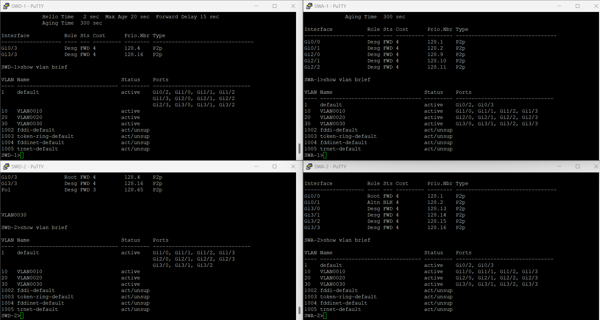
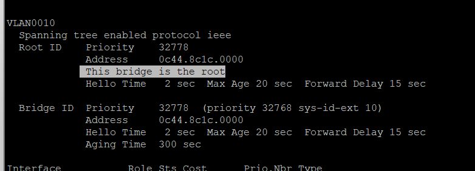

# Cisco Switches

1. Welches Spanning-Tree Protokoll ist aktiv?
 `show spanning-tree`
2. Wie viele VLANs gibt es im Netzwerk?
`show vlan brief`

## SWD-1

## SWD-2

## SWA-1

## SWA-2

3. Passe die Spanning-Tree Version auf allen Geräten auf Rapid-PVST an.

Zuerst müssen wir den Modus wechseln:
`enable`

Dann in denn Konfigurierungs Modus:
`configure`

Nun die Version anpassen:
`spanning-tree mode rapid-pvst`

Danach aus dem Modus und speichern:
`exit`
`write`

Zum schluss testen:
`show spanning-tree summary`
